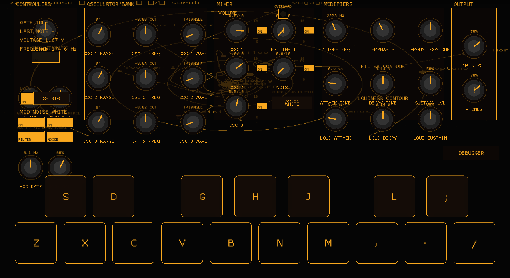

# MiniRoog Model R



MiniRoog Model R is a Macroquad + CPAL homage to the classic MiniMoog Model D.
It replicates the amber panel styling, playable computer keyboard (Z/X/C… for
white keys, S/D/G… for the blacks), and a compact mono synth voice built from
three VCOs, ladder filter, mixer, and modifiers.

## Features

- **Controllers**: Tune, Glide (with bypass switch), Mod Mix, Mod Rate/Amount,
  Noise/LFO source switch, OSC.3/Filter envelope destination switch, Oscillation
  Mod toggle, OSC3 keyboard control, Decay switch, and an S-TRIG button.
- **Oscillator Bank**: Three oscillators with Model D wave sets (Tri, Tri/Saw,
  Saw, Pulse widths; OSC3 also has Reverse Saw) and range selector covering LO,
  32′, 16′, 8′, 4′, 2′. Fine-tune sweeps ±8 semitones.
- **Mixer**: Level knobs/toggles for oscillators, colored-noise generator,
  external-input placeholder, overload lamp tied to actual clipping.
- **Modifiers**: Ladder filter with cutoff/emphasis/amount of contour, dual ADSR
  envelopes (filter + loudness) with Decay switch routing, modulation routing to
  filter or oscillator pitch.
- **Output & Debug**: Main volume (phones placeholder), reopenable waveform/FFT
  scope, console logging for switch changes.

## Running

```bash
cargo run
```

Requires the default CPAL audio output and opens a 1280×720 Macroquad window.

## Keyboard Layout

- White keys: `Z X C V B N M , . /`
- Black keys: `S D G H J L ; ' ] \`
- `Tab` cycles the noise color; S-TRIG button retriggers the envelopes.

## Project Layout

- `src/main.rs` – UI, panel state, keyboard controller.
- `src/vco.rs`, `src/oscillatorbank.rs` – VCO state/sample generation.
- `src/mixer.rs`, `src/modifiers.rs`, `src/output.rs` – Audio pipeline, ladder
  filter, envelopes.
- `assets/` – Background/texture assets.
- `static/screenshot.png` – Screenshot used above.

## Status

Some Model D conveniences (external input path, phones volume, mod/pitch wheels)
are still stubs, but the core signal flow is live and musical. Contributions to
flesh out the remaining panel sections are welcome!
